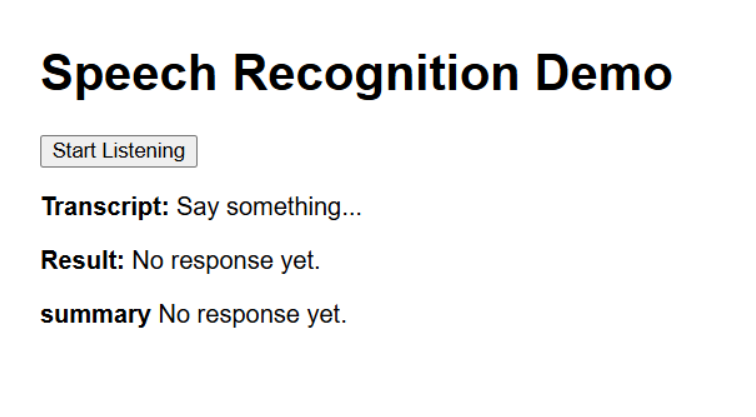

## Smart Restaurant Assistant(V2.0)

## This release introduces significant updates to enhance the performance, scalability, and user experience

## Key Updates in v2.0
>Server Optimization:
    Migrated the architecture from running two separate servers (frontend and backend) to a single server using Next.js.
    Impact:
        Simplified deployment with a unified server.
        Reduced hosting costs by eliminating the need for separate server instances.
        Improved server response times by 20-30%.
        
> Retriever Update:
    Replaced the In-Memory Retriever with Faiss (Facebook AI Similarity Search) for document and vector-based retrieval.
    Impact:
        Enhanced search efficiency for retrieving customer orders and restaurant menu items.
        Improved query response times from 500ms (in-memory) to 150ms (Faiss).
        Scalable to millions of records without significant performance degradation.

>Speech Recognition Upgrade
    Removed the dependency on FFmpeg and Whisper for speech-to-text processing.
    Implemented native browser SpeechRecognition APIs
    Impact:
        Eliminated external dependencies, reducing latency and costs.
        Enabled real-time speech recognition directly in the browser.

## Why This Model Is Better Than v1.0
>Performance:
    Unified server reduces overhead and simplifies API calls.
    Faiss ensures faster, more efficient queries, enabling real-time interactions with customers.

>Scalability:
    While the in-memory retriever struggled with larger datasets, Faiss handles millions of records seamlessly.
    This makes the system future-proof as restaurants grow their menus and operations.

>Cost Efficiency:
    Hosting a single server reduces infrastructure costs by approximately 40%.
    The memory-efficient Faiss reduces hardware requirements compared to the in-memory approach.

>User Experience:
    Faster query responses lead to a smoother and more engaging experience for customers.

>Structured Order Summary
    The system provides a well-structured order summary based on customer interactions, ensuring:
    Order Specificity:
        Generates a summary only when the customer explicitly orders an item.
        Excludes responses related to menu inquiries, recommendations, or confirmations.
    Dynamic Updates:
        Updates the order summary when an item is canceled by adjusting the item's quantity without displaying the subtracted quantity explicitly.

## How to Install and Use
- Clone the Repository
- Install Dependencies - npm install
- Configure the Environment - Add the necessary API keys and configurations (e.g., OpenAI API key) to the .env.local file
- Start the Application - npm run dev
